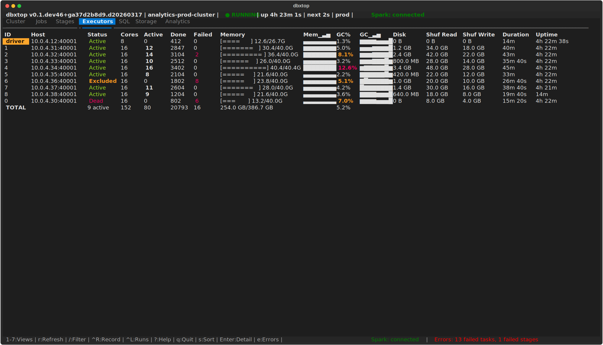
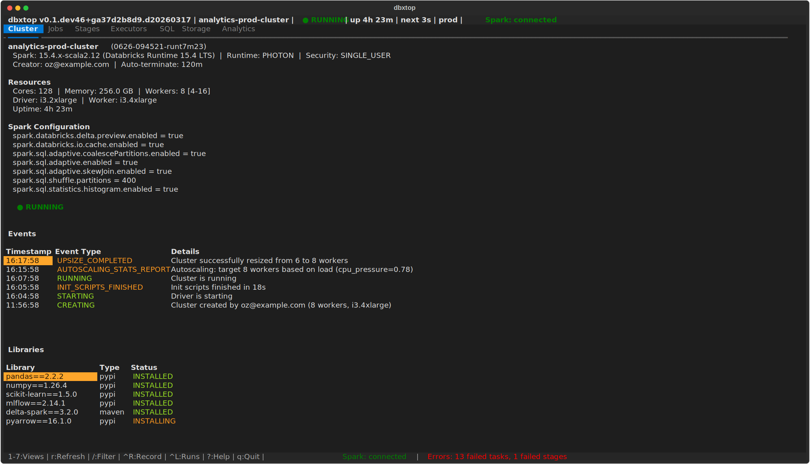
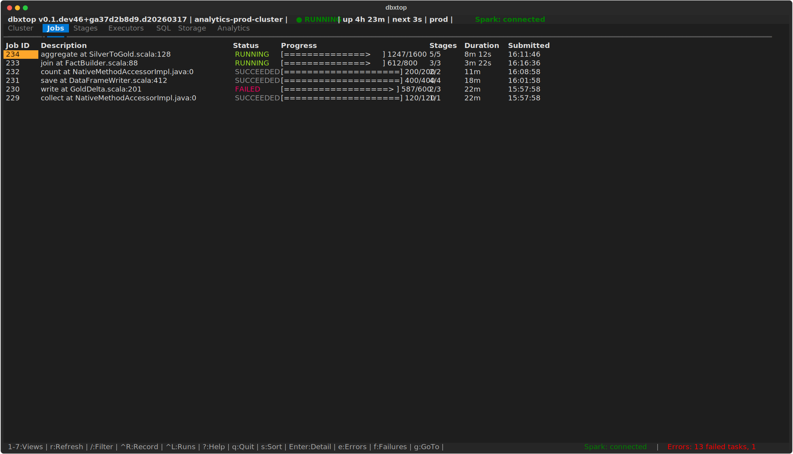
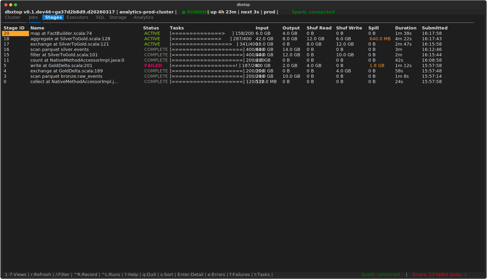
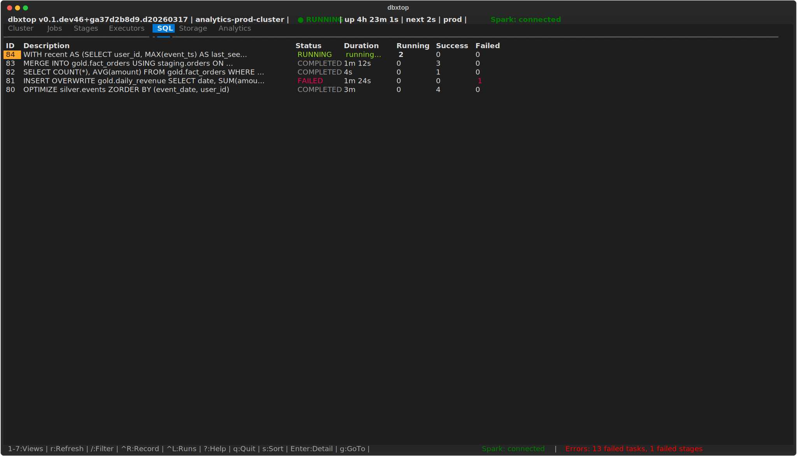
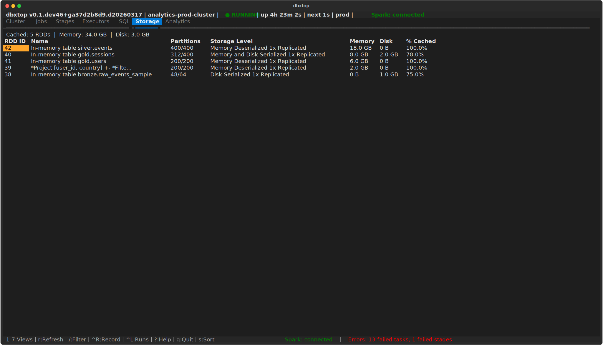
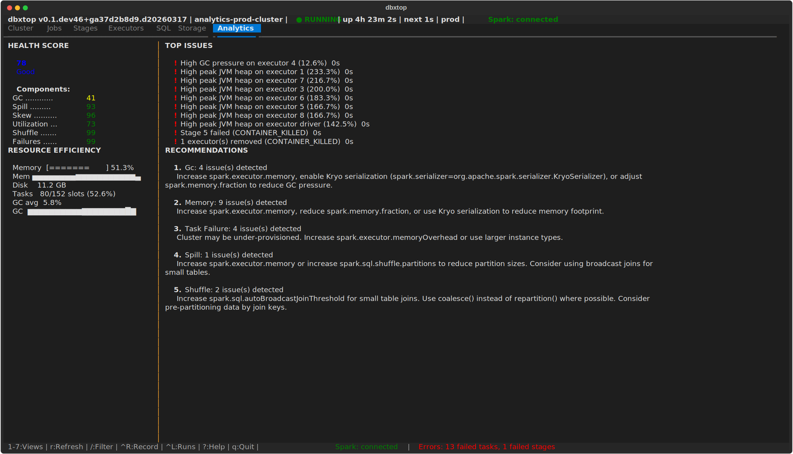

# dbxtop

[](https://pypi.org/project/dbxtop/)
[](https://pypi.org/project/dbxtop/)
[](https://github.com/OzLe/dbxtop/actions/workflows/ci.yml)
[](https://opensource.org/licenses/MIT)

Real-time terminal dashboard for Databricks/Spark clusters. Think `htop`, but for your Spark jobs.

<p align="center">
  
</p>

## Features

**6 live-updating views**, all from a single terminal session:

| View | What it shows |
|------|---------------|
| **Cluster** | State, node counts, uptime, Spark config, events, libraries |
| **Jobs** | Spark jobs with progress bars, stage counts, duration |
| **Stages** | Stages with task progress, shuffle/spill metrics, I/O bytes |
| **Executors** | Memory bars, GC%, disk, shuffle, sparkline trends per executor |
| **SQL** | SQL query status, duration, job counts |
| **Storage** | Cached RDDs/DataFrames, memory/disk usage, partition counts |

**More highlights:**

- Two-tier polling: fast (3s) for executors/jobs/stages, slow (15s) for cluster metadata
- Graceful degradation: works in SDK-only mode when Spark REST is unavailable
- OAuth token auto-refresh: handles token expiry transparently
- Dark and light themes
- Read-only: never mutates cluster state

## Screenshots

<table>
  <tr>
    <td align="center" width="50%"><strong>Cluster overview</strong><br>State, resources, Spark config, events, libraries</td>
    <td align="center" width="50%"><strong>Spark jobs</strong><br>Progress bars, stage counts, duration, status</td>
  </tr>
  <tr>
    <td></td>
    <td></td>
  </tr>
  <tr>
    <td align="center"><strong>Stages</strong><br>Task progress, shuffle read/write, spill, I/O bytes</td>
    <td align="center"><strong>SQL queries</strong><br>Running and completed queries with durations</td>
  </tr>
  <tr>
    <td></td>
    <td></td>
  </tr>
  <tr>
    <td align="center"><strong>Storage</strong><br>Cached RDDs/DataFrames, memory and disk usage</td>
    <td align="center"><strong>Analytics</strong><br>Health score, top issues, recommendations</td>
  </tr>
  <tr>
    <td></td>
    <td></td>
  </tr>
</table>

> Screenshots are generated from synthetic demo data via
> `python scripts/generate_demo_screenshots.py` — no live cluster required.

## Install

```bash
pip install dbxtop
```

Or with pipx for isolated installation:

```bash
pipx install dbxtop
```

## Quick Start

```bash
# Requires a configured Databricks CLI profile (~/.databrickscfg)
dbxtop --cluster-id <CLUSTER_ID>

# With a specific profile
dbxtop --profile my-workspace --cluster-id 0123-456789-abcdefgh

# Short flags
dbxtop -p my-workspace -c 0123-456789-abcdefgh

# Light theme
dbxtop -c <CLUSTER_ID> --theme light
```

### Finding your cluster ID

- **Databricks UI:** Compute > click cluster > copy ID from URL or details
- **Databricks CLI:** `databricks clusters list --profile <profile>`
- **Format:** `XXXX-XXXXXX-XXXXXXXX` (e.g., `0123-456789-abcdefgh`)

## Configuration

### CLI Options

| Flag | Short | Default | Description |
|------|-------|---------|-------------|
| `--profile` | `-p` | `DEFAULT` | Databricks CLI profile name |
| `--cluster-id` | `-c` | *(required)* | Target cluster ID |
| `--refresh` | | `3.0` | Fast poll interval (seconds) |
| `--slow-refresh` | | `15.0` | Slow poll interval (seconds) |
| `--theme` | | `dark` | Color theme (`dark` or `light`) |

### Environment Variables

All CLI flags can also be set via environment variables:

| Variable | Maps to |
|----------|---------|
| `DBXTOP_PROFILE` | `--profile` |
| `DBXTOP_CLUSTER_ID` | `--cluster-id` |
| `DBXTOP_REFRESH` | `--refresh` |
| `DBXTOP_SLOW_REFRESH` | `--slow-refresh` |
| `DBXTOP_THEME` | `--theme` |

### Connection Setup

dbxtop uses the standard Databricks CLI profile system (`~/.databrickscfg`):

```ini
[my-workspace]
host = https://adb-1234567890.1.azuredatabricks.net
token = dapi...
```

OAuth and U2M authentication are also supported. Run `databricks auth login --profile <name>` to set up.

## Keyboard Shortcuts

| Key | Action |
|-----|--------|
| `1`-`6` | Switch views (Cluster, Jobs, Stages, Executors, SQL, Storage) |
| `Tab` / `Shift+Tab` | Next / previous tab |
| `r` | Force refresh all data |
| `s` | Cycle sort column |
| `/` | Filter rows (type to search, Enter to apply) |
| `Escape` | Clear filter |
| `Enter` | Open detail popup (Jobs, Stages, SQL views) |
| `?` | Toggle help overlay |
| `q` | Quit |

## Requirements

- Python 3.9+
- A Databricks workspace with a configured CLI profile
- A running (or recently terminated) cluster to monitor

## Development

```bash
git clone https://github.com/ozlevi/dbxtop.git
cd dbxtop
python3 -m venv .venv && source .venv/bin/activate
pip install -e ".[dev]"

# Run tests
pytest tests/ -v --ignore=tests/test_integration.py

# Lint
ruff check src/ tests/
ruff format --check src/ tests/

# Live reload during development
textual-dev run --dev "dbxtop -c CLUSTER_ID -p PROFILE"
```

## Version Management

The version is defined in `src/dbxtop/__init__.py` as the single source of truth. `pyproject.toml` reads it dynamically via `[tool.hatch.version]`. The version is also displayed in the TUI header bar.

To bump the version, edit `__version__` in `src/dbxtop/__init__.py`:

```python
__version__ = "0.2.0"
```

## Disclaimer

THIS SOFTWARE IS PROVIDED "AS IS", WITHOUT WARRANTY OF ANY KIND, EXPRESS OR
IMPLIED, INCLUDING BUT NOT LIMITED TO THE WARRANTIES OF MERCHANTABILITY,
FITNESS FOR A PARTICULAR PURPOSE AND NONINFRINGEMENT. IN NO EVENT SHALL THE
AUTHORS OR COPYRIGHT HOLDERS BE LIABLE FOR ANY CLAIM, DAMAGES OR OTHER
LIABILITY, WHETHER IN AN ACTION OF CONTRACT, TORT OR OTHERWISE, ARISING FROM,
OUT OF OR IN CONNECTION WITH THE SOFTWARE OR THE USE OR OTHER DEALINGS IN THE
SOFTWARE.

**dbxtop is an independent open-source project and is not affiliated with,
endorsed by, or sponsored by Databricks, Inc.** Use at your own risk. The
authors assume no responsibility for any impact on your Databricks clusters,
workspaces, or data. dbxtop operates in read-only mode and does not modify
cluster state (except when the optional `--keepalive` flag is used).

## License

[MIT](LICENSE)
